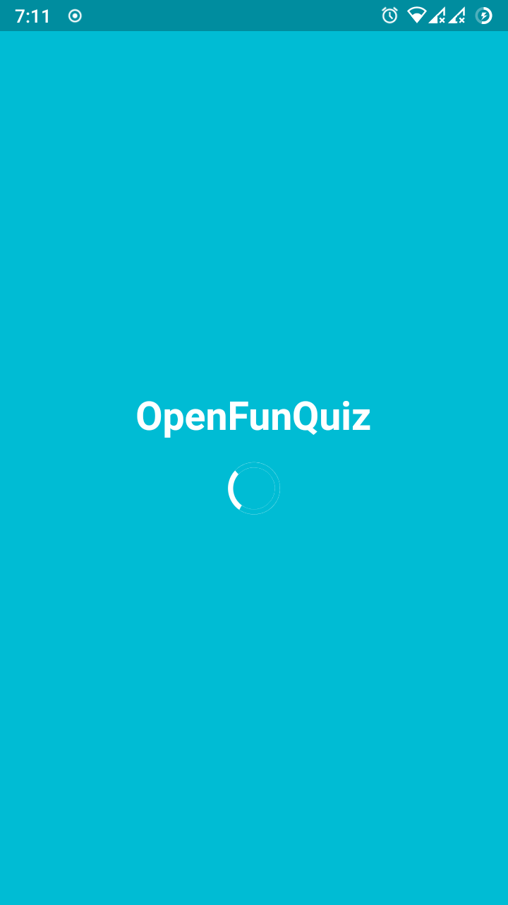
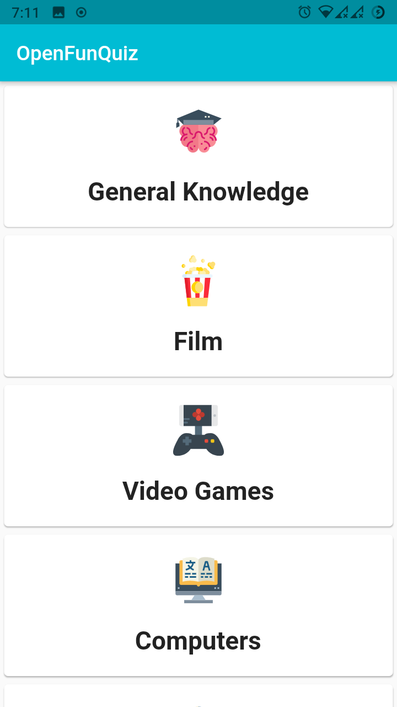
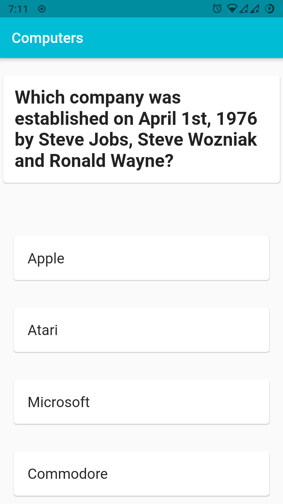

# OpenFunQuiz

Simple fun quiz app project i built on top of OpenTDB API using Flutter & Dart, It's my first project in Flutter, so even though the app is functional, considering my noob experience with Flutter, the project is on top of spaghetti code. Which will be improved and untangled upon as i make further progress in my learnings. Am open sourcing the project for everyone to build upon or to just play around with it.

# API Use Credits

Thanks to OpenTDB team for creating a great API with an open database of great trivia questions

[OpenTDB](https://opentdb.com/)

# Icons Use Credits

All the icons used in the app are designed by wonderful designer's from www.flaticon.com

Artists Names:

* [smalllikeart](https://www.flaticon.com/authors/smalllikeart)
* [smashicons](https://www.flaticon.com/authors/smashicons)
* [wanicon](https://www.flaticon.com/authors/wanicon)
* [freepik](https://www.flaticon.com/authors/freepik)

# App Screenshots

